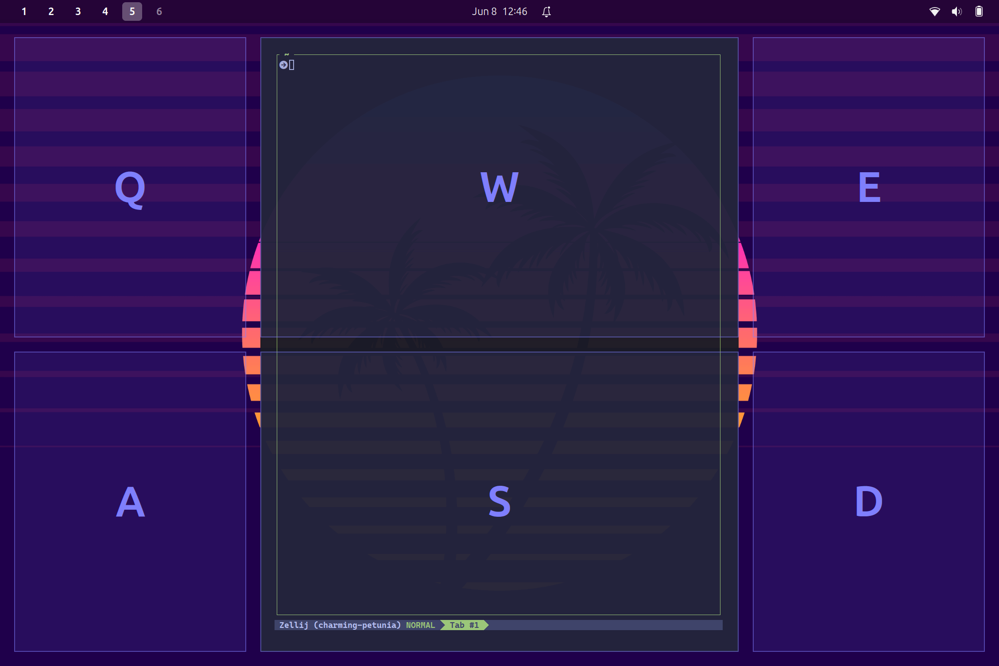
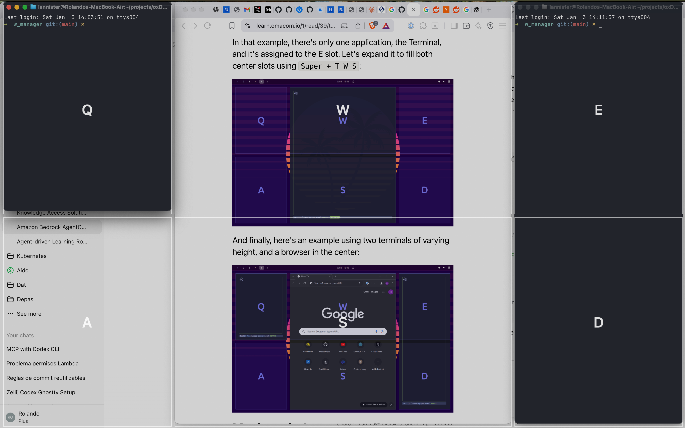
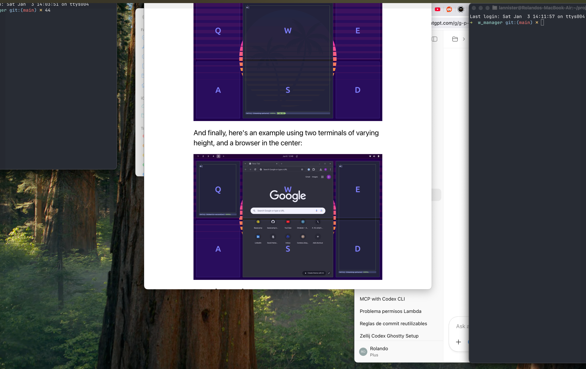

# WManager

Minimal tiling helper for macOS (Swift + AppKit). This is a focused, low-overhead
utility: global hotkeys, simple layouts, no window tracking daemon.

## What it does
- Two-way tiling (left, right, maximize) similar to GNOME.
- A configurable "Tactile" grid with up to 4 columns x 3 rows (Q/W/E/R,
  A/S/D/F, Z/X/C/V) and optional spanning by pressing multiple slots in sequence.
- A lightweight overlay to preview the grid.
- Layout presets with per-desktop or global selection.

## Requirements
- macOS 13+ (per `Package.swift`).
- Tested with Swift 6.2.3 (Xcode 26.2 toolchain).

## Inspiration
This project is inspired by the Omakub tiling manager and its keyboard-driven
window placement workflow. See the manual here: [Omakub Manual](https://learn.omacom.io/1/read/39/tiling).



## Build and run
```bash
swift run
```

The first run will prompt for Accessibility permission. Grant it in
System Settings -> Privacy & Security -> Accessibility.

## Run without `swift run`
Build once and run the release binary directly:
```bash
swift build -c release
.build/release/WManager
```

## Launch at login (LaunchAgent)
Install a user LaunchAgent that runs the release binary on login:
```bash
scripts/install-launchagent.sh
```

To unload it later:
```bash
launchctl unload "$HOME/Library/LaunchAgents/com.wmanager.plist"
```

If you move the repo or rebuild to a different location, re-run the script so
the LaunchAgent points at the correct binary path.

## Hotkeys (default)
- Command + Option + Left: left half
- Command + Option + Right: right half
- Command + Option + Up: maximize (within the visible frame)
- Command + Option + T: toggle the grid (Esc to dismiss)
- Control + Shift + 1..4: select the active layout preset for the current desktop
- Q/W/E/R/A/S/D/F/Z/X/C/V: choose slots while the grid is visible (based on layout)
- Enter: dismiss the grid
- Escape: dismiss the grid

While the grid is visible, switch focus (Command + Tab or click another window)
and press Q/W/E/A/S/D to place that window.
The grid auto-closes after selecting two slots by default; adjust
`overlaySelectionMaxCount` in `Sources/WManager/Settings.swift` if you prefer a
different limit or `nil` for no limit.

You can change modifiers, gaps, and colors in `Sources/WManager/Settings.swift`.

## Layout settings
Open the status bar menu and choose Settings... to configure layout presets,
column/row weights, and whether layouts apply per desktop or globally.
Use Control + Shift + 1..4 to switch presets; with per-desktop layouts enabled,
the selection is stored per Space.

## Notes
- Some windows do not allow resizing or have minimum sizes.
- Full-screen apps are not managed.
- If you switch to Command-only modifiers, expect conflicts with common app
  shortcuts (e.g., Command + Left/Right in browsers).

## Screenshots



